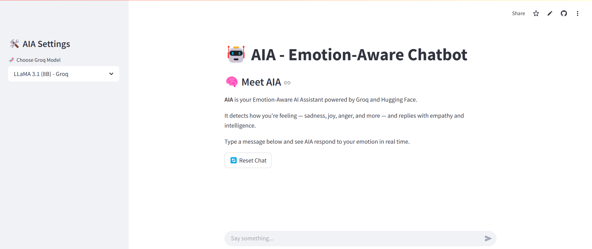
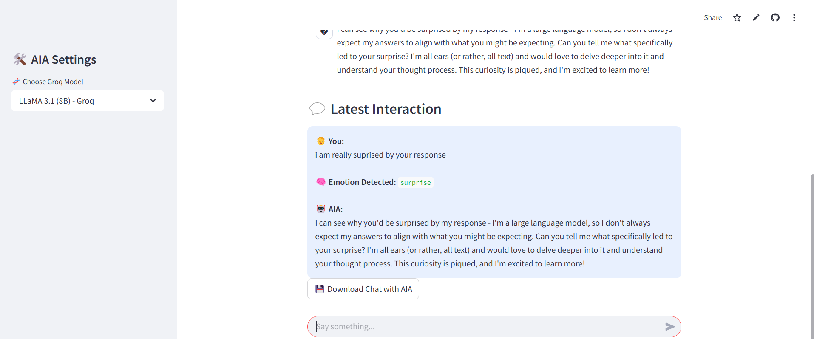

# 🤖 AIA: Emotion-Aware Chatbot

**AIA** is an intelligent, emotion-aware chatbot designed to dynamically adapt its conversational tone based on user emotions. Built using a powerful Hugging Face model and accelerated with Groq's lightning-fast large language models, AIA delivers highly personalized, empathetic responses in real time.

---
## 🎥 Watch the Demo + Live App

📺 **YouTube Demo:**  
[Watch the full walkthrough](https://youtu.be/zLB3NETrFOA?si=V5RZtlpGB8EJmfHJ)

🌐 **Live Chatbot (Streamlit):**  
[Launch AIA on Streamlit Cloud](https://aia-klanuyihnvhbayzb5hgqxy.streamlit.app/)

---

## 🧠 Emotion Classifier Model

We use the Hugging Face model [`michellejieli/emotion_text_classifier`](https://huggingface.co/michellejieli/emotion_text_classifier), which was evaluated on the **MELD (Multimodal EmotionLines Dataset)** and achieved a **74% classification accuracy**. Based on this strong performance, it was selected over other alternatives for our chatbot.

---

## 🖼️ Interface Preview



---

## 💡 Features

- 🎭 Emotion detection across 7 categories: joy, sadness, anger, fear, surprise, disgust, and neutral
- 🧠 Hugging Face-powered classification with proven accuracy on MELD dataset
- ⚡ Real-time response streaming using Groq LLMs
- 🧬 Choose from multiple Groq models via sidebar
- 🎨 Emotion-specific UI with colored chat bubbles
- 🔄 Chat reset and memory clearing
- 💾 Option to download complete conversation history
- 🔐 Secure API management with `.env` and Streamlit secrets

---

## 🚀 Tech Stack

| Tool | Purpose |
|------|---------|
| [Streamlit](https://streamlit.io) | UI framework |
| [Hugging Face Transformers](https://huggingface.co/transformers) | Emotion classification |
| [Groq API](https://groq.com) | Large language model responses |
| [Python Dotenv](https://pypi.org/project/python-dotenv/) | Local environment variable management |

---

## ⚙️ Setup Instructions

1. **Clone the repository:**

```bash
git clone https://github.com/your-username/aia-chatbot.git
cd aia-chatbot

```

2. **Create and activate a virtual environment:**

```bash
python -m venv venv
source venv/bin/activate  # On Windows: venv\Scripts\activate
```
3. **Install dependencies:**

```bash
pip install -r requirements.txt
```

4. **Create a .env file in the root folder and add:**

```bash
GROQ_API_KEY=your-groq-api-key
HF_TOKEN=your-huggingface-access-token
```

5. **Run the app:**

```bash
streamlit run app.py
```

---

📁 Folder Structure

```bash
aia-chatbot/
│
├── app.py                  # Main Streamlit app
├── requirements.txt        # Python dependencies
├── .env                    # API credentials (ignored by Git)
├── .gitignore
├── README.md
└── assets/
    ├── aia-interface.png   # Screenshot of main UI
    └── image.png           # Emotion demo preview

```